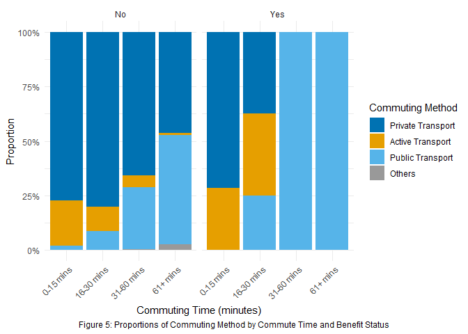

Descriptive and Inferential Analysis of Transport Habits and Benefit

Status: Evidence from the APS 2021 Flawiya Shirish More

library(tidyverse)  # Data wrangling and plotting
library(gdslStats)  # Advanced statistical functions and estimations
library(scales)     # Data visualization scales and formatting
library(patchwork)  # Combining multiple ggplot2 plots into layouts
library(ggplot2)    # Creating elegant data visualizations
library(moments)    # Calculating skewness and kurtosis
library(survey)     # Survey analysis and chi-square tests
library(devtools)   # Package development and management tools
library(forcats)
library(stringr)
library(gt)

load(APS)

print("Inspecting the Continuous variable: Commute_Time")

[1] "Inspecting the Continuous variable: Commute_Time"

meta_data$Commute_Time$value_labels

                 label value
1            No answer    -8
2       Does not apply    -9
3 0 or works from home     0
4                 180+   180

# Creating a new variable by excluding the invalid values:
APS$Commute_Time_Valid <- replace(APS$Commute_Time, 
                                  which(APS$Commute_Time %in% c(-8, -9, 0)), NA)

 [1] "Does not apply"                   "No answer"                       
 [3] "Car or van"                       "Motorbike or moped"              
 [5] "Bicycle"                          "Bus or coach"                    
 [7] "Taxi"                             "Train"                           
 [9] "Underground, tram, light railway" "Walk"                            
[11] "Other method"                    

# Creating new variable by removing invalid responses:
APS$Commute_Method_Valid <- fct_na_level_to_value(APS$Commute_Method,extra_levels = c("Does not apply", "No answer"))

skewness(APS$Commute_Time_Valid, na.rm = TRUE)

[1] 2.817616

median(APS$Commute_Time_Valid,na.rm=TRUE)

[1] 20

IQR(APS$Commute_Time_Valid, na.rm=TRUE)

[1] 20

ggplot(data = subset(APS, !is.na(Commute_Time_Valid)), 
       aes(x = Commute_Time_Valid)) +
  geom_histogram(binwidth = 5, fill = "#56B4E9", color = "white") +
  labs(
    x = "Commute Time (mins)",
    y = "Count",
    caption = "Figure 1. Distribution of Valid Commute Time"
  ) +
  theme_minimal() +
  theme(
    plot.caption = element_text(hjust = 0.5), 
    plot.title = element_text(size = 15, face = "bold", hjust = 0.5)
  )

# Find the category with maximum frequency
freq_commute_method <- names(commute_method_list)[which.max(
  commute_method_list)]
print(paste("Most frequent Commute_Method:", freq_commute_method))

[1] "Most frequent Commute_Method: Car or van"

SRDI(APS$Commute_Method_Valid, na.rm = TRUE)

[1] 9.443737

# Creating bins and label for Commute_Time_Valid
time_breaks <- c(0, 15, 30, 60, Inf) # bins
time_labels <- c("0-15 mins", "16-30 mins", "31-60 mins", "61+ mins")

table(APS$Commute_Time_Grouped) # display frequency and labels for Commute_time_Grouped

 0-15 mins 16-30 mins 31-60 mins   61+ mins 
     32051      25907      14542       3684 

APS$Commute_Method_Grouped <- fct_collapse(APS$Commute_Method_Valid,
"Private Transport" = c("Car or van", "Motorbike or moped", "Taxi"), 
"Public Transport" = c("Bus or coach", "Train", "Underground, tram,\nlight railway"), "Active Transport" = 
  c("Bicycle", "Walk"), "Others" = "Other method")

# Display frequency and labels for Commute_Method_Grouped
table(APS$Commute_Method_Grouped)

Private Transport  Active Transport  Public Transport            Others 
            63903             10890              9424               535 

# Create the cross-tabulation data (COLUMN percentages) ---
Cross_tab_c <- tab(APS, Commute_Time_Grouped ~ Commute_Method_Grouped, 
                   measure = "col_pct", na.rm = TRUE)

Table 1: Commute Time Distribution by Commuting Method

Commuting Time (minutes)

Commuting Method (Column Percent)

Private Transport

Active Transport

Public Transport

Others

0-15 mins

43.58

64.09

6.83

18.97

16-30 mins

36.60

27.61

25.27

13.85

31-60 mins

16.82

7.88

47.02

16.41

61+ mins

2.99

0.42

20.89

50.77

ggplot(
  data = subset(APS, !is.na(Commute_Time_Grouped) & !is.na(
    Commute_Method_Grouped)),
  aes(x = Commute_Time_Grouped, fill = Commute_Method_Grouped)
) +
  geom_bar(position = "dodge") +
  scale_fill_manual(
    values = c(
      "Private Transport" = "#0072B2",
      "Active Transport" = "#E69F00",
      "Public Transport" = "#56B4E9",
      "Others" = "#999999"
    )
  ) +
  labs(
    x = "Commuting Time (minutes)",
    y = "Count",
    fill = "Commuting Method",
    caption = "Figure 3. Commuting Method by Commuting Time"
  ) +
  theme_minimal() +
  theme(
    plot.caption.position = "plot",
    plot.caption = element_text(hjust = 0.5, size = 9, margin = margin(t = 10))
  )

    Pearson's X^2: Rao & Scott adjustment

data:  svychisq(~Commute_Time_Grouped + Commute_Method_Grouped, design = subset(aps_design,     !is.na(Commute_Time_Grouped) & !is.na(Commute_Method_Grouped)))
F = 898.62, ndf = 8.6873e+00, ddf = 6.6175e+05, p-value < 2.2e-16

# Calculate confidence intervals for column percentages using survey design
CI_pct_raw <- ci_pct(Cross_tab_counts, design = aps_design, over = "col")

Figure 1: Commuting Time Distribution within each Transport Method

# Creating unweighted tab
unweighted_tab <- tab(Commute_Time_Grouped ~ Commute_Method_Grouped, 
                      data = APS, 
                      measure = "row_pct", na.rm=TRUE)

Table 2. Unweighted Row Percentages for Commuting Time by Commuting Method

Commute_Time_Grouped

Commute Method (Percent)

Private Transport

Active Transport

Public Transport

Others

0-15 mins

77.21

20.80

1.88

0.12

16-30 mins

80.22

11.08

8.59

0.10

31-60 mins

65.68

5.63

28.47

0.22

61+ mins

46.17

1.20

49.95

2.69

# Create the weighted table
weighted_tab <- tab(Commute_Time_Grouped ~ Commute_Method_Grouped, 
                    data = APS, 
                    weights = Weight_APS,
                    measure = "row_pct", na.rm=TRUE)

Table 3. Weighted Row Percentages for Commuting Time by Commuting Method

Commute_Time_Grouped

Commute Method (Percent)

Private Transport

Active Transport

Public Transport

Others

0-15 mins

73.74

23.82

2.35

0.10

16-30 mins

75.18

13.25

11.43

0.15

31-60 mins

58.18

6.64

35.00

0.18

61+ mins

40.81

1.45

55.69

2.05

# Calculate the difference
difference_tab <- weighted_tab - unweighted_tab

Table 4. Difference in Row Percentages (Weighted - Unweighted)

Commute_Time_Grouped

Difference (Percentage Points)

Private Transport

Active Transport

Public Transport

Others

0-15 mins

−3.48

+3.02

+0.47

−0.02

16-30 mins

−5.05

+2.17

+2.84

+0.04

31-60 mins

−7.49

+1.00

+6.53

−0.04

61+ mins

−5.36

+0.25

+5.74

−0.64

[1] "Frequency and Percentage distribution for Benefit Income"

  Var1   Freq Percent
1   No 248997    99.6
2  Yes   1000     0.4

Figure 2

